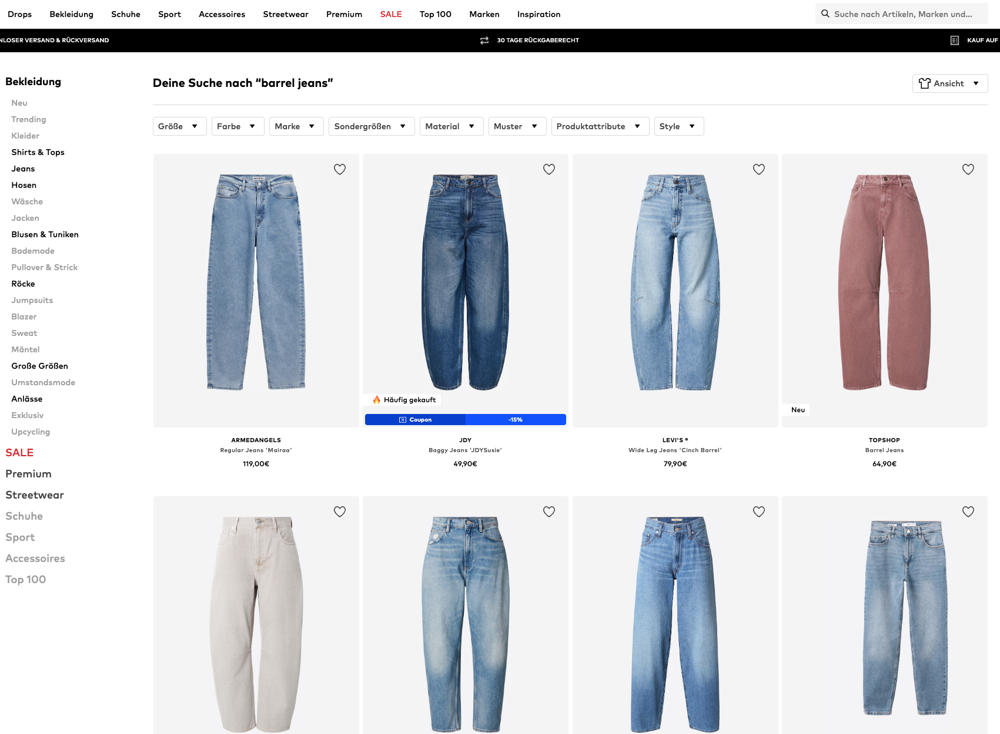

# Case Study: Search Reranking at ABOUT YOU

## Goal

Develop a prototype that **reranks** products on the ABOUT YOU search results page (SRP). Search already returns a set of candidate products per query; your task is to **re-order** that set so products users engaged with rank higher — using historical click behaviour, without changing which products are retrieved.



## Task

1. **Prototype development:** Build a reranker using the provided dataset. It should take a `search_term` and return an ordered list of `product_id`s from the candidates available for that term in the data. Explain **why** you chose your approach (heuristic, statistical model, ML, etc.).

2. **Data exploration & QA (nice-to-have):** If time allows, sketch a lightweight way to inspect reranking results (notebook, small dashboard, tables with product images, …) — this is **not** the main deliverable. A **working prototype** matters more than a polished exploration UI.

3. **Next steps & future directions:** Outline how you would improve the prototype with more time — e.g. ranking across unseen search terms, personalization, better offline evaluation, or online A/B tests.

4. **Communication & alternatives:** Prepare a concise (**15–20 minute**) presentation for a product owner (non-technical audience): approach, results on a few example queries, alternatives you considered, and trade-offs.

## Data

Two files are provided under `data/`:

### `search_term_products.parquet`

One row per **search term × product** that appeared on the SRP (aggregated over several months of semantic search traffic). Columns:

| Column | Description |
|--------|-------------|
| `search_term` | Query text entered by the user |
| `product_id` | Product identifier |
| `clicks` | Number of product clicks on the SRP for this term–product pair |
| `impressions` | Number of product impressions on the SRP |
| `ctr` | Click-through rate in percent (`clicks / impressions × 100`) |
| `impression_pos_avg` | Average list position when the product was impressed |
| `impression_pos_median` | Median impression position |
| `click_pos_avg`, `click_pos_median` | Average / median position when clicked (null if no clicks) |

**Interpretation:** For each `search_term`, treat the rows as your **fixed candidate set** to rerank. **Clicks** are the main signal that users “liked” a product in context of that query.

**Baseline (for your own evaluation):** A simple reference order is by `impression_pos_avg` ascending (roughly the logged display order). A good reranker should beat sorting by clicks alone on sparse pairs and should not only reproduce position.

**Suggested metric (optional):** e.g. NDCG@10 using click-based relevance on the candidates per term. You may choose other metrics; state assumptions clearly.

### `products.csv`

Metadata for products in the export: `product_id`, `product_name`, `image_hash`, `product_url`.

Product images can be loaded from the CDN, e.g.:

`https://cdn.aboutstatic.com/file/{image_hash}?quality=75&height=640&width=480`


### Setup

Dependencies are managed with [uv](https://docs.astral.sh/uv/):

```bash
uv sync
uv run python -c "import pandas as pd; pd.read_parquet('data/search_term_products.parquet').head()"
```

You may use any other tools or libraries you prefer.

## Deliverables

* **Prototype code** — e.g. Jupyter notebook, Python module under `src/`, or a small app.
* **Presentation** — slides or equivalent walkthrough of your approach and findings.
* **Supporting materials (optional)** — plots, QA screenshots, short write-up.

## Timebox

Limit your effort to **5–6 hours**. State clearly what you would do next if you had more time.

## Submission

Please send your code and presentation **48 hours before** the interview.

## Focus

We care about a **practical, well-explained** solution within the timebox: sound judgement on signals and bias, working code, and clear communication to non-technical stakeholders. Choice of libraries and level of model complexity is up to you.
