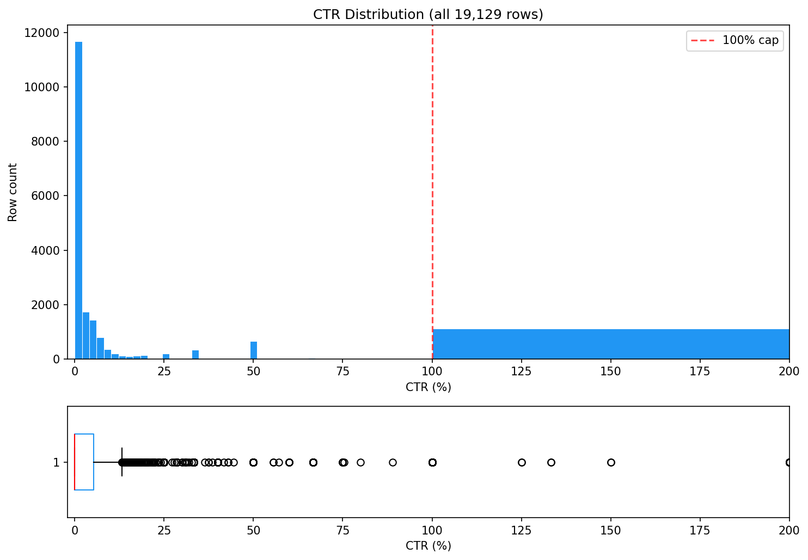
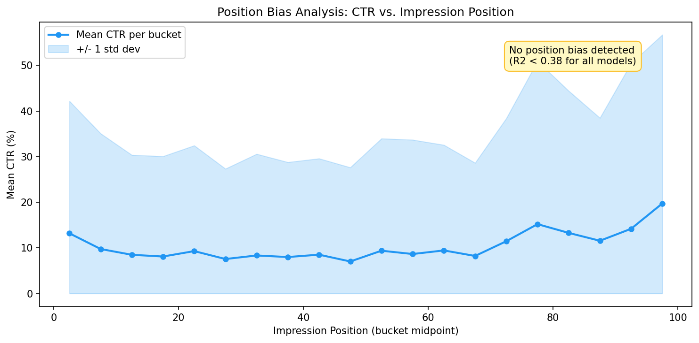
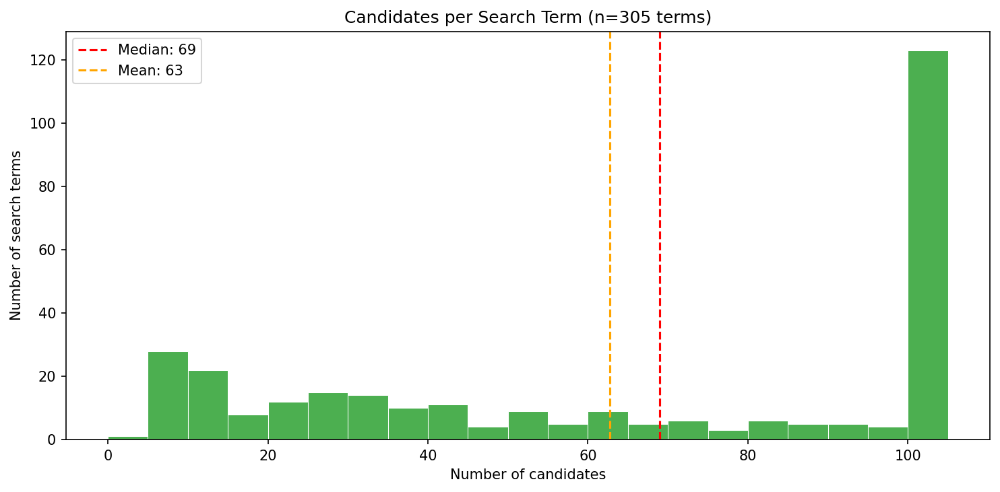
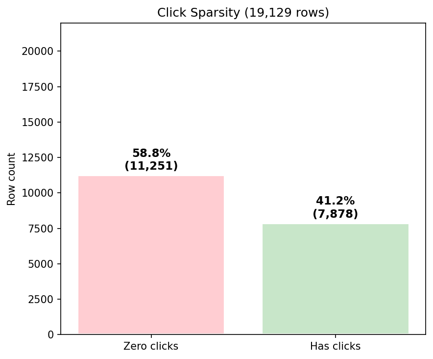

# EDA Findings — Search Reranking Prototype

This document merges all exploratory data analysis findings into a single source of truth that directly informs the RerankConfig parameters.

---

## 1. Dataset Overview

**Rows:** 19,129  |  **Search terms:** 305  |  **Products:** 16,697  |  **Memory:** 1.6 MB

| Statistic | Candidates per term |
|-----------|---------------------|
| min | 4 |
| max | 100 |
| median | 69.0 |
| mean | 62.7 |
| p5 | 7 |
| p95 | 100 |
| p99 | 100 |

No duplicate (search_term, product_id) pairs found.

---

## 2. Click Sparsity

- **Zero clicks:** 11,251 rows (58.8%)
- **Has clicks:** 7,878 rows (41.2%)

### Click Distribution (all rows)

| Statistic | Value |
|-----------|-------|
| count | 19,129 |
| mean | 37.95 |
| std | 120.85 |
| min | 0.0 |
| max | 5,899.0 |
| p50% | 0.0 |
| p90% | 118.0 |
| p95% | 188.0 |
| p99% | 426.16 |

### Click Distribution (clicked rows only)

| Statistic | Value |
|-----------|-------|
| count | 7,878 |
| mean | 92.16 |
| std | 174.55 |
| min | 1.0 |
| max | 5,899.0 |
| p50% | 58.0 |
| p90% | 209.0 |
| p95% | 298.0 |
| p99% | 677.46 |

---

## 3. CTR Distribution

- **CTR = 0%:** 59.3% of rows
- **CTR > 100%:** 51 rows (0.27%)
- **Low impressions (< 3):** 7,339 rows (38.4%)

| Statistic | Value |
|-----------|-------|
| count | 19,129 |
| mean | 10.69 |
| std | 26.72 |
| min | 0.0 |
| max | 500.0 |
| p25% | 0.0 |
| p50% | 0.0 |
| p75% | 5.3 |
| p90% | 33.33 |
| p95% | 100.0 |
| p99% | 100.0 |

### CTR > 100% — NOT a data error

51 rows (0.27%) have CTR exceeding 100%. This is NOT a data pipeline bug. Customers click via bookmarks, push notifications, or email links which generate click events without a corresponding SRP impression.

**Implication:** Raw CTR (`clicks/impressions x 100`) is an unreliable metric. Decoupled clicks (engagement signal) and impressions (confidence signal) in the scoring formula.

Impression distribution for these rows:
- 1 impression: 44 rows
- 2 impressions: 3 rows
- 3 impressions: 2 rows
- 4 impressions: 2 rows

---

## 4. Position Columns

### impression_pos_avg
- Non-null: 19,027  |  Null: 102 (0.5%)
- min=1.0  max=664.0  median=26.0  mean=38.0

### impression_pos_median
- Non-null: 19,027  |  Null: 102 (0.5%)
- min=1.0  max=664.0  median=19.0  mean=30.8

### click_pos_avg
- Non-null: 7,878  |  Null: 11,251 (58.8%)
- min=1.0  max=658.0  median=31.0  mean=44.6

### click_pos_median
- Non-null: 7,878  |  Null: 11,251 (58.8%)
- min=1.0  max=658.0  median=20.0  mean=34.9

### Position-Click Correlation
- Correlation (impression_pos_avg vs click_pos_avg): r = 0.959
- Interpretation: Products impressed at higher positions also clicked at higher positions (expected — tautological for this data).

---

## 5. Position Bias Analysis

**Method:** CTR aggregated into position buckets (width=5), adaptive merge for buckets < 30 rows.

### CTR by Position Bucket

| Bucket | Rows | Mean Pos | Mean CTR | Median CTR | Correction Factor |
|--------|------|----------|----------|------------|-------------------|
| 0-4 | 1,248 | 2.7 | 13.19 | 0.0 | 1.000 |
| 5-9 | 1,842 | 7.3 | 9.75 | 0.0 | 1.352 |
| 10-14 | 2,022 | 12.3 | 8.48 | 0.0 | 1.555 |
| 15-19 | 2,089 | 17.2 | 8.11 | 0.0 | 1.627 |
| 20-24 | 1,917 | 22.2 | 9.29 | 0.0 | 1.420 |
| 25-29 | 1,714 | 27.2 | 7.56 | 0.0 | 1.746 |
| 30-34 | 1,351 | 32.1 | 8.33 | 1.6 | 1.583 |
| 35-39 | 980 | 37.3 | 7.99 | 2.3 | 1.651 |
| 40-44 | 869 | 42.5 | 8.51 | 2.6 | 1.550 |
| 45-49 | 793 | 47.3 | 7.02 | 2.1 | 1.880 |
| 50-54 | 584 | 52.3 | 9.38 | 2.4 | 1.407 |
| 55-59 | 517 | 57.2 | 8.65 | 0.0 | 1.525 |
| 60-64 | 439 | 62.2 | 9.44 | 2.1 | 1.397 |
| 65-69 | 358 | 67.2 | 8.23 | 1.7 | 1.603 |
| 70-74 | 308 | 72.1 | 11.46 | 0.0 | 1.152 |
| 75-79 | 265 | 77.1 | 15.20 | 0.0 | 0.868 |
| 80-84 | 226 | 82.2 | 13.28 | 0.0 | 0.993 |
| 85-89 | 173 | 87.2 | 11.56 | 0.0 | 1.141 |
| 90-94 | 139 | 92.1 | 14.19 | 0.0 | 0.930 |
| 95-99 | 135 | 97.3 | 19.73 | 0.0 | 0.669 |

### Model Fit Assessment

| Model | R2 |
|-------|-----|
| Linear (CTR = a*pos + b) | 0.3428 |
| Log-linear (exponential decay) | 0.3718 |
| Power-law (CTR = C * pos^a) | 0.0644 |

**Conclusion: No position bias detected.**

All R2 values are below 0.38 — position explains little variance in CTR. Deep positions (95-99) have the highest mean CTR (19.73%) while top positions (0-4) have 13.19%.

### Why No Position Bias?

The data aggregates months of search traffic across queries of vastly different specificity. A broad query like "kleid" shows 100 candidates with flat CTR at all positions. A niche query like "anti cellulite sporthose kurz" has few candidates — motivated users scroll through all of them, producing high CTR even at the last result position.

Position correlates more with **query specificity** than with **relevance quality**. Deep-position products aren't worse — they answer very specific intent.

**Implication for scoring:** Position correction would harm the reranker. Products on niche queries earned deep-position clicks legitimately and should not be penalised.

---

### Clicks per Term Distribution

| Statistic | Value |
|-----------|-------|
| min | 5.0 |
| max | 43,594.0 |
| median | 12.0 |
| mean | 2,380.4 |
| p95 | 15,142.0 |
| p99 | 29,177.2 |

---

## 7. Seasonality Bias — Known Limitation

The dataset aggregates several months of search traffic. Products that were heavily clicked 6 months ago may no longer be trending. The prototype treats all data equally — this is a known limitation, not a defect.

### Tradeoff
- **Current approach:** All data equally weighted. Simple, no time dimension needed.
- **Production approach:** Add recency decay — `weighted_clicks = clicks * exp(-lambda * days_since_last_click)` — or use a sliding time window (e.g., last 30 days only).

### Future directions for seasonality
1. **Recency decay:** Exponential decay weighting by recency of click data
2. **Time-windowed aggregation:** Rolling 30/60/90 day windows with freshness score
3. **Trend detection:** Identify rising/falling products per query over time
4. **A/B testing:** Compare reranker with and without recency decay in production

---

## 8. Visualisations

Generated by `src/explore/visualise.py`.

### CTR Distribution

Heavy right skew with a spike at 100%. 59.3% of rows have CTR=0. The 100% CTR spike represents the 1,115 rows with 1 click / 1 impression. CTR > 100% (51 rows) is clipped at 200% on the x-axis.

### Position Bias Curve

The flat line is the key finding: CTR does not decay with position. All R² values < 0.38. Deep positions (75-99) actually show *higher* CTR because niche queries with few candidates produce highly motivated clickers. Position correction would harm the reranker.

### Candidates per Search Term

Median 69 candidates per term, with a hard cap at 100 (p95 = p99 = 100). The distribution is right-skewed — most terms have 60-100 candidates, a few have < 10 (very niche queries).

### Click Sparsity

58.8% of rows have zero clicks. This moderate sparsity justifies Beta-binomial smoothing (Strategy D) but not the extreme smoothing that would be needed at 90%+ sparsity.

---